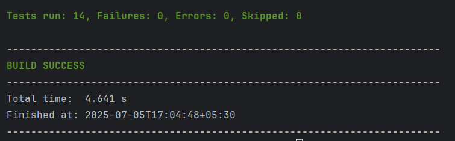

# String Calculator TDD Kata

[](https://openjdk.java.net/projects/jdk/21/)
[](https://maven.apache.org/)
[](https://junit.org/junit5/)
[](#)

## Overview

Implementation of the String Calculator TDD Kata following Test-Driven Development practices. This project demonstrates the Red-Green-Refactor cycle and maintains 100% test coverage.

## Features

| Feature | Description | Example |
|---------|-------------|---------|
| Basic Operations | Empty string, single/multiple numbers | `add("1,2")` → `3` |
| Custom Delimiters | Single char, multi-char, multiple | `add("//;\n1;2")` → `3` |
| Newline Support | Numbers separated by newlines | `add("1\n2,3")` → `6` |
| Negative Validation | Throws exception with all negatives | `add("-1,2,-3")` → Exception |
| Large Number Filter | Numbers > 1000 ignored | `add("2,1001")` → `2` |
| Input Validation | Handles non-numeric tokens | `add("1,X,3")` → `4` |

## Technology Stack

| Component | Version | Purpose |
|-----------|---------|---------|
| Java | 21 | Core language |
| JUnit 5 | 5.9.3 | Testing framework |
| Maven | 3.8+ | Build tool |

## Getting Started

### Prerequisites
- Java 21 or higher
- Maven 3.8 or higher

### Build and Run
```bash
# Clone and build
git clone <repository-url>
cd incubyte
mvn clean compile

# Run tests
mvn test

# Generate reports
mvn surefire-report:report
```

## Usage Examples

```java
// Basic operations
StringCalculator.add("");           // Returns: 0
StringCalculator.add("1");          // Returns: 1
StringCalculator.add("1,2");        // Returns: 3
StringCalculator.add("1\n2,3");     // Returns: 6

// Custom delimiters
StringCalculator.add("//;\n1;2");           // Returns: 3
StringCalculator.add("//[***]\n1***2***3"); // Returns: 6
StringCalculator.add("//[*][%]\n1*2%3");    // Returns: 6

// Error handling
StringCalculator.add("1,-2,3");     // Throws: "negatives not allowed: -2"
```

## Project Structure

```
src/
├── main/java/com/incubyte/
│   └── StringCalculator.java     # Core implementation
└── test/java/com/incubyte/
    └── StringCalculatorTest.java # Test suite
```

## Testing Coverage

| Metric | Coverage | Description |
|--------|----------|-------------|
| Line Coverage | 100% | All lines executed |
| Branch Coverage | 100% | All branches tested |
| Method Coverage | 100% | All methods tested |



*All tests passing with 100% coverage*

## Project Structure

### Test Categories
- **Basic Functionality**: Empty strings, single/multiple numbers
- **Delimiter Handling**: Default, custom, multi-character delimiters
- **Edge Cases**: Large numbers, non-numeric tokens
- **Error Scenarios**: Negative numbers, invalid input

## TDD Implementation

### Three Laws of TDD
1. Write production code only to make a failing test pass
2. Write only enough of a test to fail
3. Write only enough production code to make the test pass

### Development Process
| Phase | Action | Purpose |
|-------|--------|---------|
| Red | Write failing test | Define expected behavior |
| Green | Write minimal code | Make test pass |
| Refactor | Improve code | Maintain quality |

## Key Design Principles

- **Single Responsibility**: Each method has one clear purpose
- **Clean Code**: Meaningful names and small functions
- **Error Handling**: Comprehensive validation with clear messages
- **Extensibility**: Easy to add new features

> This project is a demonstration of disciplined software craftsmanship and test-first development using modern Java practices.
